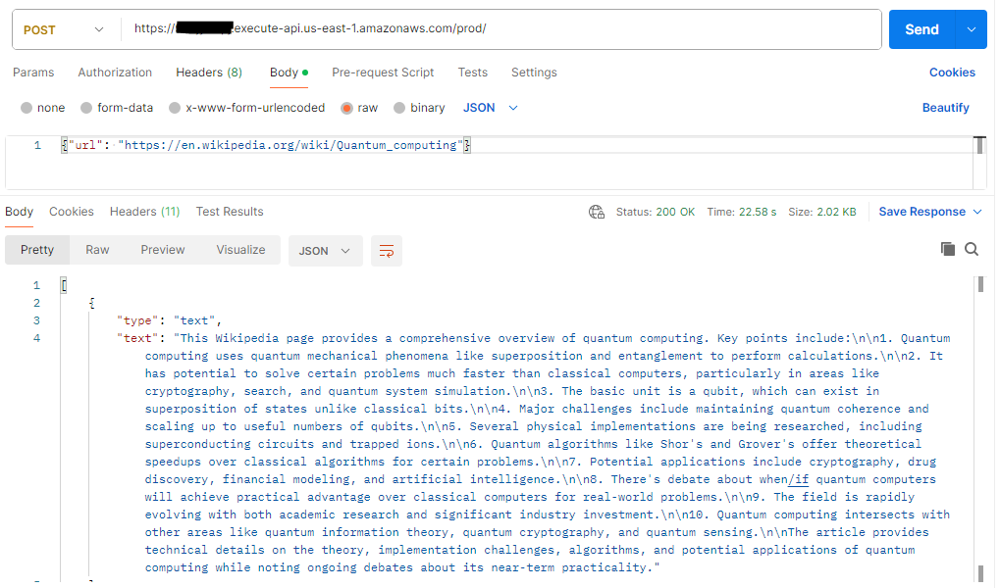

# Summarize Website using AWS Bedrock and Anthropic's Claude 3.5 Sonnet model

In this example project, we demonstrate Website content Summarization using AWS Bedrock Anthropic's Claude 3.5 Sonnet Foundation model and expose as an API.  

This project is developed using AWS CDK in TypeScript.

## What does it build?
* Creates an AWS Lambda function that interacts with AWS Bedrock
* Uses Anthropic's Claude 3.5 Sonnet model for Content Summarization
* Uses user provided Website URL for parsing data
* Generates a Summary of the Website content
* Creates an AWS API Gateway endpoint to expose the API

## Steps to run and test
* Deploy the CDK code. Wait for the deploy to finish.  It will print out the API endpoint for you to use.
  * 

## References
* Learn about [AWS Bedrock](https://aws.amazon.com/bedrock/)
* [Anthropic's Claude 3.5 Sonnet model](https://www.anthropic.com/news/claude-3-5-sonnet)
* AWS Bedrock [Foundation Models](https://docs.aws.amazon.com/bedrock/latest/userguide/models-supported.html)